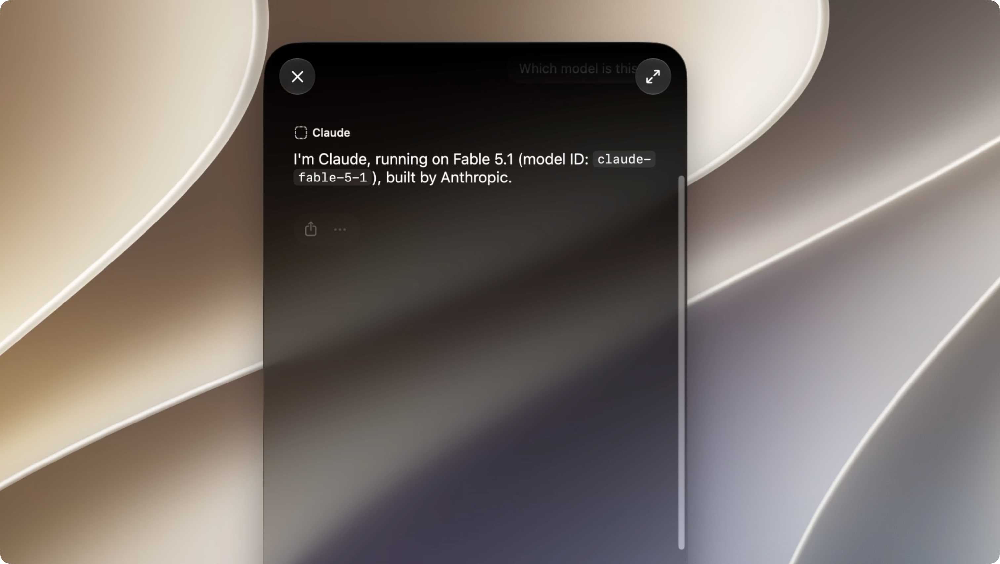

# Claude for Siri

Use your signed-in Claude Code account from macOS Spotlight and Siri. The menu bar app starts its built-in Swift bridge automatically.



## TL;DR — how to use it

> **Experimental: requires macOS 27 with SIP and AMFI disabled.** This lowers macOS security protections and uses private, beta-specific APIs. Use a development Mac. The app and scripts do not disable SIP or AMFI for you. This is an independent example, not an official Apple or Anthropic integration.

1. Install **Xcode 27**, accept its license and install its first-launch components. Install **XcodeGen** (`brew install xcodegen`) and [Claude Code](https://code.claude.com/docs/en/overview). Sign in with `claude auth login`.
2. Build and install the app:

   ```sh
   git clone https://github.com/mpociot/claude-siri-ai.git
   cd claude-siri-ai
   ./scripts/install.sh
   ```

3. In the **Claude** window, click **Test Connection**. The app finds common Claude CLI installations automatically; use **Choose Claude CLI…** if needed.
4. Click **Enable in Spotlight…** and authenticate in the macOS administrator dialog. This temporarily restarts Siri and Spotlight with expanded provider discovery.
5. Press **⌘Space**, right-click the input, choose **Ask… → Claude**, and send a prompt. Complete Apple's **Turn On** flow if prompted.

Keep the app running: closing its settings window leaves the bridge in the menu bar. **Open at login** is optional. After a reboot or a Siri service restart, use **Enable in Spotlight…** again. **Restore Normal Discovery** undoes the temporary process override.

The installer uses `~/Applications/Claude.app`. If another app already occupies that location, installation stops. Anthropic's `/Applications/Claude.app` is separate.

## What works

- Provider discovery, consent, and invocation have been demonstrated in Spotlight.
- The Swift bridge has passed a live request using an authenticated Claude Code account.
- The app's built-in discovery button has been tested, and macOS reports **Claude** as installed and available. A full native Spotlight conversation with the current app build still needs a separate manual check.
- Responses stream into Apple's native response UI. Each request starts a fresh conversation.
- Writing Tools support is implemented for selected text, but has not been verified in its native UI.

The provider currently handles **text only**. It does not generate images, accept attachments, execute device actions, or access Siri's mail, contacts, messages, or semantic index. Apple's generic onboarding sheet can mention image generation and show a placeholder icon; those do not describe the example's capabilities.

Tested on macOS 27 build **26A428** with Xcode 27 **27A266a**. Provider discovery is still experimental: Spotlight, Siri's separate Ask menu, and System Settings can show different provider lists. See [discovery findings and the earlier input issue](docs/discovery.md).

## Can Claude be the default “Ask” provider?

There is **no verified system-wide default setting for this custom extension** on the tested build. Explicitly selecting **Ask… → Claude** is the working route. Selecting a provider for a conversation is not proof that future Spotlight windows or ordinary Siri requests will use it.

The local framework contains private `selectedLLMId`, `defaultLLM`, and `intendedDefaultLLM` APIs. Its selected and default IDs currently resolve to `com.apple.openai.chatgpt`. These belong to the partner-model settings path; we have not established that changing them makes a third-party `AgentIntent` the default Ask destination. The app deliberately does not expose an unverified “Make default” toggle.

Apple's [documented ChatGPT integration](https://support.apple.com/guide/mac-help/use-chatgpt-with-apple-intelligence-mchlfc5cf131/mac) describes explicit “Ask ChatGPT” routing and confirmation controls. Turning off confirmation is a different setting from replacing Siri's default provider. Voice routing to this example remains unverified.

## Build and development

`./scripts/install.sh` builds, installs, and opens the app. For a build without installation:

```sh
./scripts/build.sh
# Install an already-built app:
./scripts/install.sh --skip-build
```

The build uses `xcode-select`'s Xcode. Set `DEVELOPER_DIR=/Applications/Xcode.app/Contents/Developer` if necessary. XcodeGen generates the project; both the host and extension carry the private `com.apple.developer.model-delegation` entitlement and are ad-hoc signed. No distributable Apple entitlement is granted by this setup.

A random bearer token is generated once in ignored `.local/bridge.json` and bundled in both targets. Rebuilding preserves it. Do not distribute a built bundle containing your local token. Configuration, generated projects, build products, and preference backups are excluded from Git.

The bridge, discovery script, and compiled discovery shim are embedded in the app, so the installed app does not need this checkout, Xcode, or Python at runtime. Claude Code must remain installed and signed in. During discovery sessions, keep the installed app at its current path.

For command-line discovery control:

```sh
./scripts/discovery-session.sh start
./scripts/discovery-session.sh stop
```

## How it works

```text
Spotlight / Siri
  → sandboxed ClaudeProvider.appex
  → authenticated HTTP/NDJSON on 127.0.0.1:17839
  → Swift bridge inside Claude.app
  → your signed-in Claude Code CLI
  → streamed text → native Siri response
```

The host stays outside the sandbox so it can launch your CLI; the extension is sandboxed and uses loopback networking. The CLI runs in a private temporary directory with tools disabled, no MCP servers, safe mode, no Chrome integration, and no conversation persistence. Temporary prompt input is removed after execution. Prompts, responses, and credentials are not logged by the bridge.

The server binds only to IPv4 loopback, authenticates each request, rejects browser Origin headers and ambiguous HTTP framing, and limits body size, connections, concurrent Claude processes, and execution time. The bundled token guards against accidental/browser access; it is not a security boundary against another local process that can read the app bundle.

Discovery uses a temporary, narrowly scoped runtime shim in Apple's existing Siri/provider processes. It does not edit Apple binaries, launch plists, boot arguments, entitlement checks, or provider consent. You still approve the provider in Apple's native Turn On flow. [Details and rollback](docs/discovery.md).

## Tests and troubleshooting

```sh
# Native Swift tests; no Claude account needed:
swift test --scratch-path .local/swift-build

# One live request through the running app and your Claude account:
./scripts/smoke.sh

claude auth status
pluginkit -m -A -D -v -i dev.goldengate.Claude.Provider
codesign --verify --deep --strict "$HOME/Applications/Claude.app"
```

Ten Swift tests cover HTTP authentication and request validation, incremental text delivery, completion/error handling, process timeout and cancellation, and a real localhost round trip through a fake CLI. The live smoke test returned `Claude bridge works`. Writing Tools and persistent default-provider behavior require separate native tests.

If the bridge cannot start, quit duplicate copies and check whether another process occupies port 17839. If Claude disappears from Ask, enable discovery again and complete any native consent prompt. An input-focus issue is recorded in the discovery notes.

Inspired by [pdfu's macOS 27 proof of concept](https://www.reddit.com/r/MacOSBeta/comments/1vbe2ki/apples_rumored_siri_extensions_quietly_shipped_in/). The code is an independent implementation and does not redistribute Apple binaries or SDK files.

## License

MIT. Apple and Anthropic trademarks belong to their respective owners.
